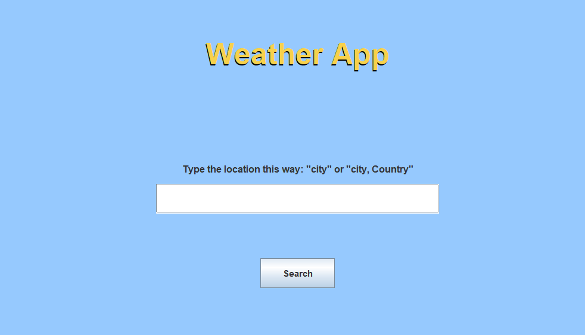
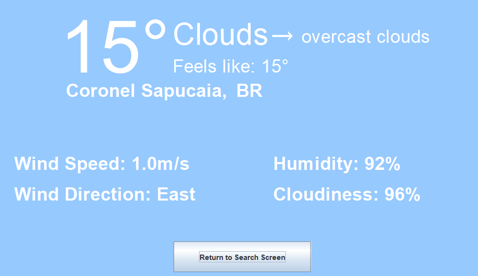

# WEATHER APP
An app that shows the current weather data of any city in the world.

## Technologies
- Java
- Maven
- Gson
- Swing
- OpenWeather Geocoding API
- Openweather Current Weather data API

## Features
- Search just the city name or city, country (e.g. Sydney or Sydney, Australia)
- Displays temperature, feels like, min/max temperature
- Displays humidity, wind speed, wind direction
- Dispays weather condition and description

## Setup
1. Clone the repository
2. Create a free account at [OpenWeather.org](https://openweathermap.org/)
3. Get your API key at [Current Weather API](https://home.openweathermap.org/users/sign_in)
4a. If using IntelliJ, go to **Run -> Edit Configurations -> Environment Variables** and add:
- WEATHER_API_KEY=yourkey
- GEO_CODING_KEY=yourkey
4b. If using any other method, Click **Windows + S** and search for **Environment Variables**,
click on **Edit the system environment variables**, then click on **Environment Variables**,
on **User Variables** click on **New**. On **Variable name** put "**GEO_CODING_API**" and on
**Variable Value** add you **API_KEY**. Do the same thing for "**WEATHER_API_KEY**", click **OK**
  on all open windows and restart the program you're using to view the app, if using any.
5- Run "**WeatherApp.java**"

## Usage
1. Type a city name in the search box (e.g. Los Angeles or Los Angeles, United States)
2. Click **Search** or press **Enter**
3. Weather data for the city will be displayed

## Notes
- Weather forecast for upcoming days was initially planned but dropped to focus on current weather conditions.
- The app currently only supports cities recognized by the OpenWeatherMap Geocoding API. There are no known non-recognized cities but they might exist
- The app was created for me to test my abilities on OOP and API implementation and since i'm a beginner, there are probably lots of things that have a better alternative way to be done but i ended up doing another way.
